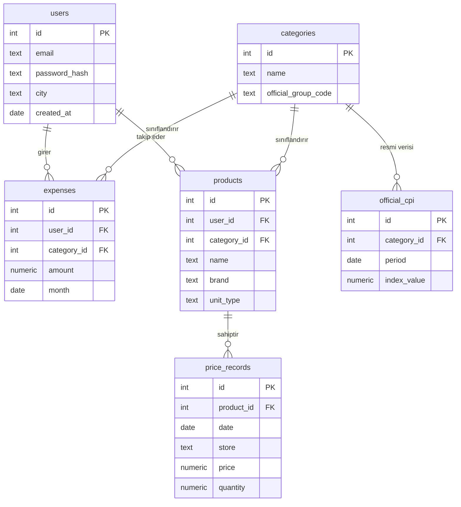

# ER Diyagramı

```mermaid
erDiagram
    users ||--o{ expenses : "girer"
    users ||--o{ products : "takip eder"
    categories ||--o{ expenses : "sınıflandırır"
    categories ||--o{ products : "sınıflandırır"
    products ||--o{ price_records : "sahiptir"
    categories ||--o{ official_cpi : "resmi verisi"

    users {
        int id PK
        text email
        text password_hash
        text city
        date created_at
    }

    categories {
        int id PK
        text name
        text official_group_code
    }

    expenses {
        int id PK
        int user_id FK
        int category_id FK
        numeric amount
        date month
    }

    products {
        int id PK
        int user_id FK
        int category_id FK
        text name
        text brand
        text unit_type
    }

    price_records {
        int id PK
        int product_id FK
        date date
        text store
        numeric price
        numeric quantity
    }

    official_cpi {
        int id PK
        int category_id FK
        date period
        numeric index_value
    }
```